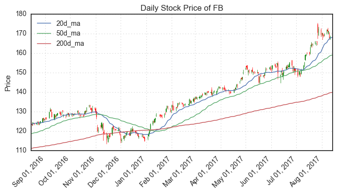

# Stock Market Analysis and Modeling  

 

## Introduction 
This project analyzes historical stock data retrived from Google Finance and performs a series of analyses and modeling to   

* understand and compare stock performance 
* build predictive models to make recommendations on trading actions   
* design and evaluate portfolio holdings and trading strategies  

### Part 1. Five-Year S&P 500 Stock Analysis (`SP500_Stock_Analysis.ipynb`)  

In this part, common performance metrics including returns, alpha, beta, sharpe ratio, and moving averages are analyzed for stocks contained in the S&P 500 index. The price data of SPY, i.e., SPDR S&P 500 trust ETF (designed to track the S&P 500 stock market index), is used as reference for performance comparisons and also serves as benchmark for calculating alpha and beta. In addition to individual stocks, the averaged performance of different stock sectors in S&P 500 are also compared. The best and worst performing stocks/sectors are found.  

#### Part 2. Machine Learning of Stock Market (ongoing)  

#### Part 3. Portfolio Holdings and Trading Strategies (ongoing)  

*** 

## Data, Libraries, and Functions  

The stock data used in this project were obtained from Google Finance. A customer script (`get_data.py`) was used to automate the process and compile all the data into one .csv file.   

The project runs in **Python 3.5** with the following Python libraries:  

- Numpy 
- Pandas 
- Matplotlib 
- seaborn 
- Scikit-Learn 

Some helper functions for the project can be find in the repo, including plotting candlestick chart with moving averages (`vis.py`), manipulating data and calculating performance metrics (`helper.py`).  

